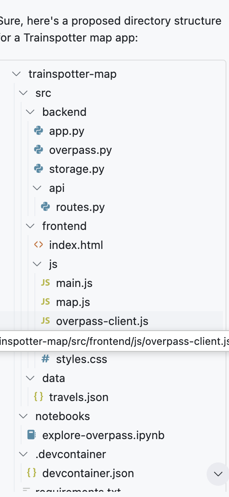

# Trainspotter
Test spara på resta järnvägar

göra en personlig “trainspotting”-karta – alltså en karta där du kan markera vilka linjer, stationer eller tågtyper du åkt med eller sett

1. Data: OpenStreetMap (via Overpass API)

2. Visualisering: Folium, Leaflet eller MapLibre

3. Spara vilka järnvägar du åkt - spara i en JSON-fil

4. UI-funktioner

Du kan bygga t.ex.:

Klicka på en linje → “Har du åkt här?” ✅

Färgändring:

Grå = ej åkt

Blå = åkt

Summering: “Du har åkt X km av Sveriges Y km järnväg”

Möjlighet att exportera till GeoJSON eller dela via en länk.

----

